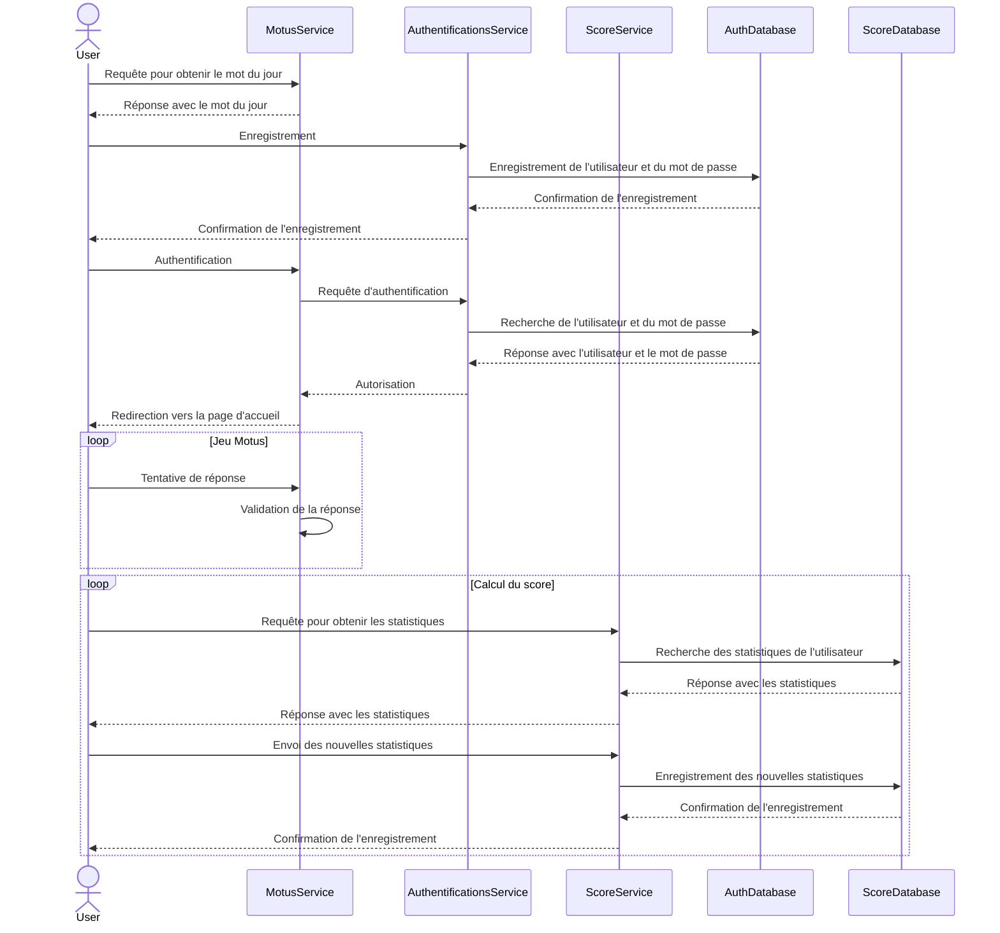

# Introduction
README du projet de micro-services.

Membres du groupe :
- BEKKRA Mohamed
- LE TOURNEAU Thomas
- MARECHAL Martin
 
# Explication du contenu du projet

### Structure Général
- Chaque microservice utilise le framework express de node js, ainsi qu'une base de donnée Redis pour stocker les informations de la session en cours.

### Quels serveurs sont utilisés ?

Il y a 3 serveurs, un par application :
- Le premier est le fichier wordFinder.js qui est utilisé pour la partie serveur du jeu mutos.
- Le second est scoreTracker.js, il s'occupe de la partie du score.
- Le dernier est app.js, il s'occupe de l'authentification.

### Informations sur les fichiers relatifs à Docker

Le fichier docker-compose.yml configure un ensemble de services Docker pour exécuter différentes parties d'une application :
- Motus Service:
    
    Image construite à partir du répertoire ./motus.
    Port exposé localement : 3000.
    Ce service héberge l'application principale "Motus".

- Score Service:
    Image construite à partir du répertoire ./score.
    Port exposé localement : 3001.
    Ce service gère les scores de l'application "Motus".


- Authentifications Service:
   Image construite à partir du répertoire ./authentifications.
   Port exposé localement : `3002`.
   Ce service gère l'authentification des utilisateurs pour l'application "Motus".

L'ensemble des ports locaux sont mappé sur le port 3000 de chaque container pour pouvoirs permettre une communication entre les différents microservices

## Fichier HTML
 ```login.html``` : Page pour se connecter
 ```motus.html``` : Page pour accéder à l'interface du jeu Motus.
 ```score.html``` : Page pour consulter les scores
 ```signin.html```: Page pour s'enregistrer


### Quelles API sont utilisées ? Quelles sont leurs paramètres ?

- Pour le micro-service Motus (partie serveur fichier Wordfinder.js) :
    - `/word` : Pour obtenir le mot du jour.
    - `/handleAuthorizationResponse` : Récupère le code d'autorisation de la requête et échange ce code contre un jeton d'identification en effectuant une requête vers le micro-service d'authentification. Si le jeton est valide, il est décodé pour extraire le nom d'utilisateur associé. Ensuite, le nom d'utilisateur est enregistré dans la session de l'utilisateur, puis l'utilisateur est redirigé vers la page d'accueil.

- Pour le micro-service score : 
    - `/getScore` : Pour récupérer les statistiques d'un utilisateur à partir de son pseudo.
    - `/setScore` : Permets d'enregistrer les statistiques d'un utilisateur dans la base de donnée. Si l'utilisateur n'existe pas, on le crée et on lui attribue un score de 0 initialement.
    - `/score` : Route pour dirigier vers la page d'affichage des score.html.
    - `/motus` : Route pour diriger vers la page d'acceuil depuis la page des scores

- Pour le micro-service authentification :

    - `/login` : Gère l'authentification des utilisateurs.
    Elle vérifie dans la base de données si la combinaison nom d'utilisateur et mot de passe existe.
    Si la combinaison est valide, elle génère un code d'authentification, l'enregistre dans la base de données, et redirige l'utilisateur vers l'URL de redirection avec le code d'authentification.
    
    - `/signin_page` : Renvoie la page HTML pour l'inscription des utilisateurs.
    Elle renvoie le contenu du fichier HTML ```signin.html```situé dans le répertoire static.

    - `/get/:key'`: Permet de récupérer la valeur du mot de passe à partir de la clé donné.

    - `/set/:key/:value`: Permet d'enregistrer un utilisateur, avec son nom d'utilisateur et son password dans la base de donnée.

    - `/authorize` : Affiche la page de connexion ```login.html``` avec redirection vers l'URI spécifiée après l'authentification, en remplaçant le placeholder {redirect_uri} par la valeur fournie dans la requête.

    - `/token` :  Cette route est utilisée pour générer un jeton d'identité (id_token) à partir d'un code d'authentification valide.
    Elle vérifie si le code d'authentification est présent dans la base de données.
    Si le code est valide, elle génère un jeton d'identité signé (id_token) et le renvoie dans la réponse.
    En cas d'absence de code d'authentification ou de code invalide, elle renvoie un code d'erreur correspondant.

    - `/signin` : Cette route reçoit les données du formulaire d'inscription, vérifie si les mots de passe correspondent, puis enregistre l'utilisateur dans la base de données d'authentification.
    En cas de succès, elle redirige l'utilisateur vers la page d'accueil.
    En cas d'échec, elle renvoie un code d'erreur correspondant.

### Est-il possible d'avoir plusieurs utilisateurs ?

Oui, le système d'authentification vérifie le nom d'utilisateur du nouvel inscrit pour s'assurer qu'il est différent des autres utilisateurs présents dans une base de données Redis puis l'enregistre en théorie (nous allons voir dans une section plus bas que nous n'avons pas réussi pour ce projet).

### Quelles sont les données stockées ?

- Nom des utilisateurs.
- Mot de passe.
- Nombre de mots trouvés.
- Nombre total de tentatives.
- Nombre moyen de tentative pour chaque mot trouvé.

 # Comment exécuter le projet ?

 *Pré-requis : Docker*

- Clonez ce dépôt GitHub sur votre machine.

- Une fois Docker installé, se placer dans le dossier racine du projet et lancer la commande suivante : `sudo docker-compose up --build`

- vous devriez voir la phrase suivant dans votre terminal "*Server is running on http://localhost:3000*"

- Il vous suffit ensuite d'accéder au lien indiqué par le terminal pour voir le projet et y jouer. 

## Informations Importantes

 # Problème rencontrer et non résolu dans les temps

 - Problème d'enregistrement des utilisateurs aprés soumissions du formulaire d'enregistrement: On arrive bien à récupérer les élements saisies mais nous avons une erreur lors de l'enregistrement dans la base de données. Les routes définies ainsi que la logique du code est cohérente, cependant il y a certaines erreurs dans les appels réseaux que nous n'avons malheuresement pas trouver dans les temps.
 
- Manque de temps pour implémenter la partie monitoring.

# Solution alternative :

- Mise en commentaire dans le Docker-compose du micro-servie d'authentification

- Création d'un formulaire `usernameForm` avant le lancement du jeu motus dans le fichier index.html afin de récupérer le nom de l'utilisateur qui va jouer au motus

- Enregistrement dans la base de donnée Redis de cet utilisateur, et mise à jour de ses statisques à 0.

- Lorsque le joueur trouvera le mot, ses statistiques sont mise à jour dans la base de données et nous pouvons les consulter en cliquant sur le bouton `Voir les scores` qui nous redirige vers la page de score.

Comme notre partie authentification ne marche pas, cette section permet de quand même jouer au motus avec 2 micro-service fonctionnel sur les 3 demandés. Vous pouvez accéder au mode du jour grâce à la route /word dans l'url.


## Diagramme de séquence 



## Diagramme de flow

```mermaid
graph TD;
    User(User) --> MotusService{MotusService};
    MotusService -->|Requête pour obtenir le mot du jour| User;
    User(User) --> AuthentificationsService{AuthentificationsService};
    AuthentificationsService -->|Enregistrement| AuthDatabase{AuthDatabase};
    AuthDatabase -->|Confirmation de l'enregistrement| AuthentificationsService;
    AuthentificationsService -->|Confirmation de l'enregistrement| User;
    User(User) --> MotusService;
    MotusService -->|Authentification| AuthentificationsService;
    AuthentificationsService -->|Recherche de l'utilisateur et du mot de passe| AuthDatabase;
    AuthDatabase -->|Réponse avec l'utilisateur et le mot de passe| AuthentificationsService;
    AuthentificationsService -->|Autorisation| MotusService;
    MotusService -->|Redirection vers la page d'accueil| User;
    User(User) --> MotusService;
    MotusService -->|Tentative de réponse| MotusService;
    MotusService -->|Validation de la réponse| MotusService;
    User(User) --> ScoreService{ScoreService};
    ScoreService -->|Requête pour obtenir les statistiques| User;
    User(User) --> ScoreService;
    ScoreService -->|Recherche des statistiques de l'utilisateur| ScoreDatabase{ScoreDatabase};
    ScoreDatabase -->|Réponse avec les statistiques| ScoreService;
    ScoreService -->|Réponse avec les statistiques| User;
    User(User) --> ScoreService;
    ScoreService -->|Envoi des nouvelles statistiques| ScoreDatabase;
    ScoreDatabase -->|Confirmation de l'enregistrement| ScoreService;
    ScoreService -->|Confirmation de l'enregistrement| User;```
