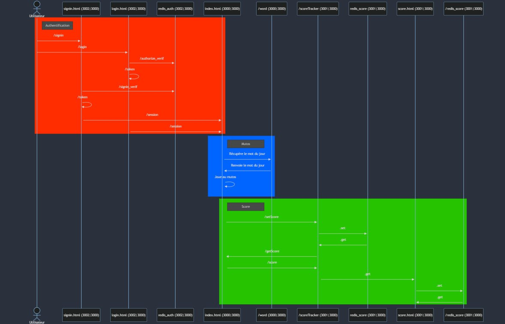

# Introuction
README du projet de micro-services.

Membres du groupe :
- BEKKRA Mohamed
- LE TOURNEAU Thomas
- MARECHAL Martin
 
# Explication du contenu du projet

### Quels serveurs sont utilisés ?

Il y a 3 serveurs, un par application :
- Le premier est utilisé pour la partie du jeu mutos.
- Le second s'occupe de la partie du score.
- Le dernier s'occupe de l'authentification.

### Sur quel port ?

- 3000 pour mutos mappé sur le port 3000 de son container.
- 3001 pour la partie score mappé sur le port 3000 de son container.
- 3002 pour la partie authentification mappé sur le port 3000 de son container.

### Quelles API sont utilisées ? Quelles sont leurs paramètres ?

- Pour mutos :
    - `/word` : Pour obtenir le mot du jour.
- Pour Score : 
    - `/getScore` : Pour récupérer le score d'un utilisateur.
    - `/setScore` : Pour l'enregistrer.
    - `/score` : rediriger vers score.html.
- Pour authentification :
    - `/authorize` : Stocke les cookies de connexion et redirige vers une page de connexion.
    - `/login` : Redirige vers login.html.
    - `/signin` : Redirige vers signin.html.
    - `/authorize_verif` : Vérifie si l'identifiant et le mdp existent dans la base de données
    - `/token` : Créer un token de connexion unique à la session de connexion.
    - `/signin_verif` : Vérifie si l'identifiant existe déjà lors de l'enregistrement, enregistre dans la base de données s'il n'existe pas.
    - `/session` : Renvoie les informations de session actuelle.

### Est-il possible d'avoir plusieurs utilisateurs ?

Oui, le système d'authentification vérifie le nom d'utilisateur du nouvel inscrit pour s'assurer qu'il est différent des autres utilisateurs présents dans une base de données Redis.

### Quelles sont les données stockées ?

- Nom des utilisateurs.
- Mot de passe.
- Nombre de mots trouvés.
- Nombre total de tentatives.
- Nombre moyen de tentative pour chaque mot trouvé.

 # Comment exécuter le projet ?

 *Pré-requis : Docker*

- Une fois Docker installé, se placer dans le dossier racine du projet et lancer la commande suivante : `sudo docker-compose up --build`

- vous devriez voir la phrase suivant dans votre terminal "*Server is running on http://localhost:3000*"

- Il vous suffit ensuite d'accéder au lien indiqué par le terminal pour voir le projet !

 # Problème rencontrer

 - Problème d'accès au client redis: On a pas réussi à resoudre l'erreur suivante :
    score-1              | ClientClosedError: The client is closed
    Donc on n'a pas réussi à faire marcher l'application pour le score
 
- Manque de temps pour implémenter la partie authentification et le monitoring.

